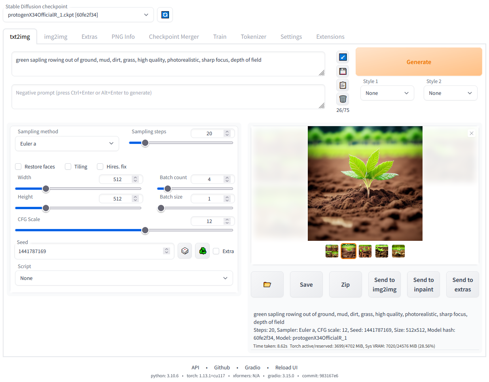

# Stable Diffusion Web UI

一个基于Gradio库实现的Stable Diffusion Web界面，提供完整的AI图像生成和管理功能。



## 🚀 核心功能

### 图像生成模式
- **文本到图像 (txt2img)**: 通过文本提示词生成图像
- **图像到图像 (img2img)**: 基于输入图像进行风格转换和编辑
- **修复绘画 (Inpainting)**: 智能填充和修复图像指定区域
- **外延绘画 (Outpainting)**: 扩展图像边界，生成更大画布
- **颜色素描**: 基于颜色素描生成完整图像

### 高级处理功能
- **高分辨率修复 (Highres Fix)**: 一键生成高分辨率图像，避免失真
- **批量处理**: 批量处理多张图像
- **提示词矩阵**: 系统化测试不同提示词组合
- **X/Y/Z图表**: 三维参数可视化，对比不同设置效果
- **循环处理**: 多次迭代img2img处理

### 模型和扩展支持
- **多模型支持**: Stable Diffusion 1.x, 2.0, 2.1, SDXL, SD3
- **LoRA微调**: 轻量级模型适配器，快速风格定制
- **Textual Inversion**: 文本嵌入训练，个性化概念学习
- **Hypernetworks**: 神经网络权重微调
- **VAE模型**: 可更换变分自编码器
- **检查点合并**: 最多合并3个模型检查点

### 内置扩展功能
- **GFPGAN**: 面部修复神经网络
- **CodeFormer**: 面部恢复工具
- **RealESRGAN**: 超分辨率图像放大
- **SwinIR/Swin2SR**: 先进的图像超分辨率
- **LDSR**: 潜在扩散超分辨率
- **ScuNET**: 图像去噪和增强
- **Soft Inpainting**: 软修复绘画技术
- **Hypertile**: 大图像分块处理优化

### 用户界面特性
- **响应式设计**: 支持桌面和移动设备
- **实时预览**: 生成过程中的实时图像预览
- **进度监控**: 详细的生成进度和状态显示
- **参数保存**: 自动保存生成参数到图像元数据
- **拖拽操作**: 支持图像和参数的拖拽导入
- **快捷键支持**: 丰富的键盘快捷键操作
- **主题定制**: 可自定义界面主题和布局

## 🛠️ 技术架构

### 核心模块
- **`webui.py`**: 主程序入口，处理Gradio界面启动
- **`launch.py`**: 环境准备和依赖管理
- **`modules/`**: 核心功能模块
  - `ui.py`: 用户界面构建
  - `txt2img.py`: 文本到图像处理
  - `img2img.py`: 图像到图像处理
  - `processing.py`: 图像处理核心逻辑
  - `sd_models.py`: 模型加载和管理
  - `shared.py`: 全局共享状态和配置

### 扩展系统
- **内置扩展**: `extensions-builtin/` 目录下的官方扩展
- **社区扩展**: 支持第三方扩展安装和管理
- **脚本系统**: 自定义Python脚本支持

### API支持
- **RESTful API**: 完整的HTTP API接口
- **WebSocket**: 实时通信支持
- **FastAPI**: 现代化的API框架

## 📋 系统要求

### 最低配置
- **操作系统**: Windows 10/11, Linux, macOS
- **Python**: 3.10.6 (推荐，新版本可能不支持torch)
- **内存**: 8GB RAM
- **存储**: 10GB 可用空间

### 推荐配置
- **GPU**: NVIDIA RTX 3060 或更高 (8GB+ VRAM)
- **内存**: 16GB+ RAM
- **存储**: SSD 50GB+ 可用空间

### 依赖项
```
torch>=1.13.0
gradio==3.41.2
transformers==4.30.2
accelerate
safetensors
Pillow
numpy
fastapi>=0.90.1
```

## 🚀 快速开始

### Windows 自动安装
1. 安装 [Python 3.10.6](https://www.python.org/downloads/release/python-3106/)，勾选"Add Python to PATH"
2. 安装 [Git](https://git-scm.com/download/win)
3. 克隆仓库：
   ```bash
   git clone https://github.com/AUTOMATIC1111/stable-diffusion-webui.git
   ```
4. 双击运行 `webui-user.bat`

### Linux 自动安装
```bash
# 安装依赖
sudo apt install wget git python3 python3-venv libgl1 libglib2.0-0

# 下载并运行
wget -q https://raw.githubusercontent.com/AUTOMATIC1111/stable-diffusion-webui/master/webui.sh
chmod +x webui.sh
./webui.sh
```

### macOS (Apple Silicon)
```bash
# 克隆仓库
git clone https://github.com/AUTOMATIC1111/stable-diffusion-webui.git
cd stable-diffusion-webui

# 运行安装脚本
./webui.sh
```

## ⚙️ 配置选项

### 启动参数
- `--port 7860`: 设置Web界面端口
- `--listen`: 允许外部网络访问
- `--share`: 创建公共分享链接
- `--xformers`: 启用xformers优化 (NVIDIA GPU)
- `--api`: 启用API模式
- `--medvram`: 中等显存模式
- `--lowvram`: 低显存模式

### 环境变量
- `PYTHON`: 指定Python解释器路径
- `GIT`: 指定Git可执行文件路径
- `VENV_DIR`: 虚拟环境目录
- `COMMANDLINE_ARGS`: 额外的命令行参数

## 📖 使用指南

### 基本图像生成
1. 在"txt2img"标签页输入提示词
2. 调整参数（分辨率、步数、CFG Scale等）
3. 点击"Generate"开始生成

### 图像编辑
1. 在"img2img"标签页上传源图像
2. 选择编辑模式（img2img、inpaint等）
3. 输入提示词和调整参数
4. 点击"Generate"开始处理

### 模型管理
- 将模型文件放入 `models/Stable-diffusion/` 目录
- 在设置页面选择默认模型
- 支持 `.ckpt` 和 `.safetensors` 格式

### 扩展安装
- 通过Web界面安装：Settings → Extensions → Install from URL
- 手动安装：将扩展放入 `extensions/` 目录

## 🔧 高级功能

### 提示词技巧
- **注意力控制**: `(关键词:1.2)` 增加权重，`[关键词:0.8]` 减少权重
- **组合提示**: `概念1 AND 概念2` 组合多个概念
- **负面提示**: 指定不希望出现的元素

### 性能优化
- **xformers**: NVIDIA GPU用户强烈推荐
- **VAE优化**: 使用优化的VAE模型
- **批处理**: 合理设置batch size
- **内存管理**: 根据显存选择合适的模式

### 自定义脚本
- 将Python脚本放入 `scripts/` 目录
- 支持txt2img和img2img处理
- 可访问所有内部API和状态

## 🐛 故障排除

### 常见问题
1. **CUDA内存不足**: 使用 `--medvram` 或 `--lowvram`
2. **模型加载失败**: 检查模型文件完整性和格式
3. **扩展冲突**: 禁用冲突的扩展
4. **网络问题**: 配置代理或使用镜像源

### 日志和调试
- 查看控制台输出的详细日志
- 使用 `--debug` 参数启用调试模式
- 检查 `tmp/` 目录下的错误日志

## 🤝 贡献指南

### 代码贡献
1. Fork 项目仓库
2. 创建功能分支
3. 提交更改并测试
4. 创建 Pull Request

### 文档贡献
- 更新Wiki页面
- 改进代码注释
- 添加使用示例

### 问题报告
- 使用GitHub Issues报告bug
- 提供详细的错误信息和系统配置
- 包含可重现的步骤

## 📄 许可证

本项目基于 [GNU Affero General Public License v3.0](LICENSE.txt) 开源许可证。

## 🙏 致谢

感谢以下项目和贡献者：
- **Stability AI**: Stable Diffusion 基础模型
- **CompVis**: 原始Stable Diffusion实现
- **Gradio**: Web界面框架
- **Hugging Face**: Transformers库
- **所有社区贡献者**: 扩展、优化和建议

## 📞 支持

- **GitHub Issues**: [问题报告和讨论](https://github.com/AUTOMATIC1111/stable-diffusion-webui/issues)
- **Wiki文档**: [详细使用指南](https://github.com/AUTOMATIC1111/stable-diffusion-webui/wiki)
- **Discord社区**: [用户交流和支持](https://discord.gg/stable-diffusion)

---

**注意**: 使用AI生成内容时请遵守当地法律法规，尊重版权和隐私权。
